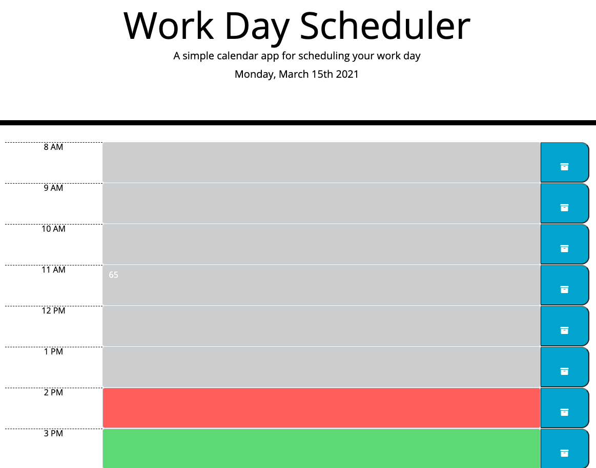

# Work Day Scheduler

## Description

- This scheduling application allows the user to add important tasks to a daily planner to manage time effectively. 
- The planner will display the current date at the top of the calendar.
- Time blocks are provided for each hour of the work day which are color-coded to indicate whether the task is past-due, present, or upcoming.
- The user can simply enter their desired task by clicking the time block (will display a textbox) and can save their task with the save button corresponding with each time block. 
- All saved events are saved in local storage and will still be available upon a page refresh. 
 

## Features

- This application uses html, css, jquery, moment.js and boostrap technologies.
- Google Fonts and Font Awesome were used for styling. 

[Link To Deployed Application]: https://github.com/adam-p/markdown-here/raw/master/src/common/images/icon48.png "Logo Title Text 2"

## Preview of application:

### ([See Deployed Application](https://msteele77.github.io/scheduler/))